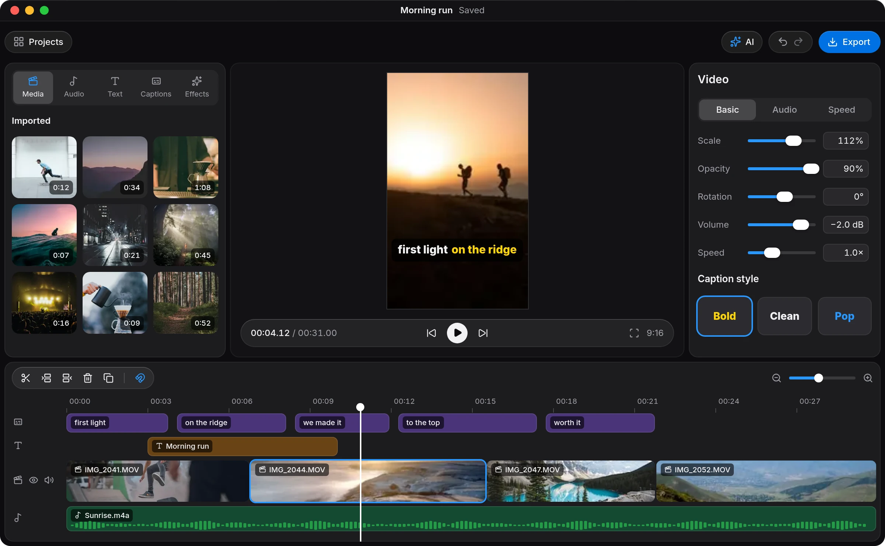

<p align="center">
  
</p>

<h1 align="center">Nuzky</h1>

<p align="center">
  A free, open-source video editor for your computer, in the spirit of CapCut.<br>
  <a href="https://nuzky.app">nuzky.app</a> · <a href="#build-and-run">Build it</a> · <a href="CONTRIBUTING.md">Contribute</a>
</p>


<p align="center"><sub>The editor as drawn on nuzky.app. The prototype differs in places.</sub></p>

Cut a talking video by deleting words from its transcript, caption it with speech recognition that runs on your own machine, and let an AI agent do the tedious parts while you watch. Nuzky is licensed under GPLv3 and has a native Rust engine.

**Nuzky is a prototype.** Editing, playback, captions and export work on Linux. macOS and Windows builds compile but have not been tested, and there is no published release yet, so for now you build it from source.

## What you can do

- Transcribe the timeline, then delete words or remove every pause straight from the text. Cuts land between words, and captions and overlays stay in sync.
- Generate captions with Whisper running on your computer. Voice detection keeps music and silence uncaptioned, and captions can highlight the word being spoken.
- Import footage straight from your phone. Rotated, mirrored and variable-frame-rate HEVC or H.264 clips cut on the exact frame. The canvas starts vertical (9:16), with 16:9, 1:1 and 4:5 a click away.
- Edit on a magnetic main track with overlay video, audio and text tracks. Move, trim, split and delete with snapping, undo and redo; Nuzky saves after every edit.
- Style text with an outline, a background box, size, colour, position, rotation and opacity.
- Export MP4 (H.264 and AAC) from the same renderer as the preview, so the file matches what you saw. The Reels & TikTok preset writes 1080×1920 at 30 fps with the sound levelled to −14 LUFS and true peak at most −1 dBTP.
- Let any MCP-capable AI agent edit the open project while you watch; each run undoes as one step. Connect agent sets up Claude Code and Codex in one click, and the AI panel chats with your own Claude Code.
- Teach Nuzky a creator's style from raw recordings and their finished cuts, on Your style in the app or with `nuzky style learn`. It writes an `EDIT.md` that agents follow, takes the creator's own rules in plain words, and lets them talk the style through with the AI.

Nuzky itself sends nothing you edit anywhere. It goes online only to download models with a pinned checksum and, at most once a day, to read the latest version number from GitHub; you can turn that check off on the home screen. An AI agent you connect runs under your own account and sends what it reads to its provider.

## Build and run

You need current stable Rust (at least 1.94), Node 22.12+, FFmpeg shared libraries with headers, clang (for bindgen) and cmake (for whisper.cpp). Linux also needs ALSA headers and WebKitGTK 4.1. [docs/BUILDING.md](docs/BUILDING.md) lists the exact dependencies for each system, the installers and the runtime libraries.

On Fedora or Nobara:

```sh
sudo dnf install ffmpeg-free-devel alsa-lib-devel clang cmake webkit2gtk4.1-devel \
  vulkan-loader-devel vulkan-headers glslc
npm install
npm run tauri dev
```

Without root on Fedora/Nobara, `bash scripts/setup-linux-deps.sh` downloads the FFmpeg and ALSA headers into `~/.cache/nuzky/deps` and writes a local `.cargo/config.toml`. The corresponding runtime libraries and WebKitGTK must already be installed. Install cmake with `pip install --user cmake` and put `~/.local/bin` on `PATH`.

On Ubuntu, `bash scripts/setup-ubuntu-deps.sh` installs the packages CI uses. For macOS and Windows, install the dependencies from [BUILDING.md](docs/BUILDING.md) and run the same npm commands. Pushing a matching `v*` version tag builds installers on all three systems and prepares a draft GitHub Release; builds are unsigned previews until verified on each system.

`npm run tauri dev` opens your own projects. To work on Nuzky without touching them, run it as [CONTRIBUTING.md](CONTRIBUTING.md) describes.

## Command line

```sh
cargo run -p nuzky-cli -- probe clip.mov
cargo run -p nuzky-cli -- new project.nuzky a.mp4 b.mov
cargo run -p nuzky-cli -- frame project.nuzky 2.5 frame.png 540
cargo run -p nuzky-cli -- render project.nuzky out.mp4
cargo run -p nuzky-cli -- render project.nuzky reel.mp4 --preset reels
cargo run -p nuzky-cli -- style learn raw.mov reel.mp4 raw2.mov reel2.mp4
cargo run -p nuzky-cli -- style compare raw.mov reel.mp4 project.nuzky
```

Projects are JSON files, so the same project renders identically in the app and on a server.

`style learn` writes the creator's `EDIT.md` into Nuzky's data folder (`--out` elsewhere, `--replace` to overwrite an existing one) from pairs of a raw recording and the finished cut made from it. `style compare` prints how much of the creator's cut a project keeps, word by word (recall and precision). Both recognise speech locally and nothing leaves the computer.

## How it works

```
crates/engine   project model, edits + undo, FFmpeg decoding, wgpu compositor,
                text rendering, audio mixing, MP4 export
crates/analysis local speech recognition, caption grouping, silence and scene analysis,
                learning a creator's style from their finished cuts
crates/vision   local face and subject models: frames worth a cover, where the person is
crates/session  editing authority, undo runs, autosave, crash recovery and transcripts
crates/mcp      agent tools, stdio bridge and live-app IPC
crates/agent    runs the user's own Claude Code for the in-app AI panel
crates/cli      `nuzky` headless CLI and MCP entry point
src-tauri       desktop shell: preview thread, audio output, background jobs, session events
src             React + TypeScript UI
```

Dependencies point one way. `engine` uses no other Nuzky crate, `analysis`, `vision` and `session` build on it, `mcp` builds on those four, and the CLI and the desktop app sit on top. `agent` stands alone; only the desktop app uses it.

- The engine renders every frame offscreen with wgpu. The preview streams those frames to the webview over a loopback WebSocket that only accepts the app's own origin and a per-launch secret. Export reuses the same renderer at full resolution.
- Each video clip decodes on its own thread with exact seeking on real timestamps, so cuts and variable frame rates stay frame accurate.
- Audio of each file is decoded once into a 48 kHz cache. Playback, export and captions all mix from it. Waveform peaks are written beside it while it decodes, and the timeline loads them in blocks around what is on screen.
- The Rust side owns the project. The UI sends edit commands and receives the new project back, and AI agents and the CLI go through the same editing authority.

More detail: [docs/INTERACTION.md](docs/INTERACTION.md) (behaviour), [DESIGN.md](DESIGN.md) (look), [docs/AI-ARCHITECTURE.md](docs/AI-ARCHITECTURE.md) (agents).

## Contributing

Nuzky is young, so a bug report helps as much as a pull request. When something breaks on a clip from your phone, open an issue with the phone, the app it was recorded in and what you did; please do not attach a private video. [CONTRIBUTING.md](CONTRIBUTING.md) explains how to set up a checkout, test your change and send a pull request, and [AGENTS.md](AGENTS.md) holds the rules for code changes, for people and coding agents alike. Report security problems privately, as [SECURITY.md](SECURITY.md) describes.

## License

GPL-3.0-or-later. FFmpeg with x264 is GPL and compatible with this licence. The export uses FFmpeg's native AAC encoder because `libfdk_aac` is not GPL compatible.
